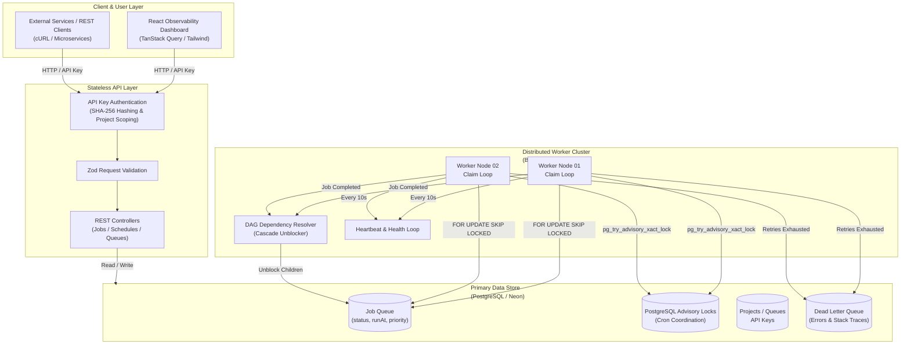

# System Architecture & Concurrency Model

Obsidian Distributed is designed as a **decoupled, multi-tenant distributed job scheduling platform**.

The architecture separates the stateless API layer, distributed worker cluster, and observability dashboard while using PostgreSQL as the central system of record and coordination layer.

The API and worker services can scale independently, while the monorepo provides a unified local development workflow through the root `package.json`.

---

## Architecture Principles

* **Stateless API layer** — API instances can scale horizontally without maintaining local job state.
* **Distributed workers** — Multiple worker nodes can process jobs concurrently.
* **Centralized PostgreSQL state** — Projects, queues, jobs, schedules, execution history, and worker state are persisted centrally.
* **Atomic job claiming** — `SELECT ... FOR UPDATE SKIP LOCKED` prevents multiple workers from claiming the same job.
* **Distributed coordination** — PostgreSQL advisory locks coordinate operations that must only execute once across worker nodes.
* **Multi-tenancy** — Projects provide isolation between users and their queues, jobs, schedules, and API credentials.
* **DAG workflows** — Jobs can depend on other jobs and are automatically unblocked when their dependencies complete.
* **Dead-letter handling** — Jobs that exhaust their retry policy are isolated in the Dead Letter Queue.
* **Independent services** — API, worker, and web applications remain independently runnable while sharing the same monorepo.
* **Unified development workflow** — The root `bun run dev` command starts the primary development services concurrently.

---

# High-Level Architecture



---

# Monorepo Service Architecture

The project is organized as a workspace-based monorepo.

```text
distributed-job-scheduler/
│
├── apps/
│   ├── api/                 # Express REST API
│   ├── worker/              # Distributed job worker
│   └── web/                 # React observability dashboard
│
├── packages/
│   └── database/            # Database client, schema & migrations
│
├── docs/
│   ├── ARCHITECTURE.md
│   ├── DATABASE_SCHEMA.md
│   └── API_REFERENCE.md
│
├── scripts/
│   └── test-dag.ts
│
├── DESIGN_DECISIONS.md
├── package.json
└── README.md
```

The services are independently runnable:

```text
@scheduler/api
@scheduler/worker
@scheduler/web
@scheduler/ws
@scheduler/database
```

The root `package.json` provides convenient commands for running these workspace applications.

---

# Local Development Architecture

The root development command starts the primary services concurrently:

```bash
bun run dev
```

The current root script launches:

```text
┌─────────────────────────────────────────────┐
│              bun run dev                    │
└─────────────────────┬───────────────────────┘
                      │
          ┌───────────┼───────────┐
          ▼           ▼           ▼
        API         WORKER        WEB
         │            │            │
         ▼            ▼            ▼
    Express API   Job Workers   React UI
```

The command is implemented using `concurrently`:

```json
{
  "scripts": {
    "dev": "concurrently -n \"API,WORKER,WEB\" -c \"blue,green,magenta\" \"bun run dev:api\" \"bun run dev:worker\" \"bun run dev:web\""
  }
}
```

This provides a single development entry point while keeping each service independently executable.

### Individual Services

The services can still be started independently:

```bash
bun run dev:api
bun run dev:worker
bun run dev:web
bun run dev:ws
```

This is useful when debugging or developing a specific part of the system.

> **Note:** `dev:ws` exists as a separate workspace command but is not currently included in the root `bun run dev` command. If the WebSocket service becomes a required runtime dependency, it can be added to the root process group.

---

# 1. Client & User Layer

The client layer consists of the React observability dashboard and external API consumers.

## Observability Dashboard

The React dashboard provides visibility into:

* Projects
* Queues
* Jobs
* Job execution status
* Retry attempts
* Scheduled jobs
* Failed jobs
* Dead-letter queue entries
* Worker health

The dashboard communicates with the REST API using authenticated HTTP requests.

## External Clients

External applications can interact with Obsidian Distributed through the REST API.

Typical clients include:

* Microservices
* Backend applications
* CLI tools
* cURL
* Internal infrastructure

Authentication is performed using project API keys.

---

# 2. Stateless API Layer

The API layer is implemented using **Express + TypeScript**.

The API does not execute background jobs itself. Instead, it validates requests and persists job instructions into PostgreSQL for workers to process asynchronously.

## Request Pipeline

```text
Client
   │
   ▼
API Key Authentication
   │
   ▼
Project Scoping
   │
   ▼
Zod Validation
   │
   ▼
REST Controller
   │
   ▼
PostgreSQL
```

### Responsibilities

* API authentication
* Project/tenant scoping
* Request validation
* Job creation
* Queue management
* Schedule registration
* Job querying
* Project management
* Returning execution information to clients

Because the API layer is stateless, multiple API instances can run behind a load balancer without requiring sticky sessions.

---

# 3. PostgreSQL — System of Record

PostgreSQL is the central persistence and coordination layer.

It stores the state required by both the API and worker clusters.

### Primary Data

```text
Projects
   │
   ├── API Keys
   │
   ├── Queues
   │      │
   │      └── Jobs
   │
   └── Schedules
```

The database also stores execution metadata such as:

* Job status
* Retry count
* Priority
* Scheduled execution time
* Result
* Error information
* Execution timestamps
* Worker ownership
* Heartbeat information

PostgreSQL transactions provide the consistency guarantees required when multiple workers operate on the same queues concurrently.

---

# 4. Distributed Worker Cluster

Workers are responsible for executing background jobs.

Multiple worker processes can operate against the same PostgreSQL database.

```text
                PostgreSQL
                     │
          ┌──────────┴──────────┐
          │                     │
          ▼                     ▼
     Worker 01              Worker 02
          │                     │
          ▼                     ▼
       Execute               Execute
        Jobs                   Jobs
```

Workers continuously poll for executable jobs and attempt to claim them atomically.

Adding additional worker processes increases the system's ability to process jobs in parallel.

---

# 5. Concurrent Job Claiming

The core concurrency mechanism uses PostgreSQL row-level locking with:

```sql
SELECT *
FROM jobs
WHERE status = 'QUEUED'
  AND run_at <= NOW()
ORDER BY priority DESC, run_at ASC
FOR UPDATE SKIP LOCKED
LIMIT 1;
```

## Why `SKIP LOCKED`?

Without `SKIP LOCKED`, multiple workers could attempt to acquire the same row and wait for one another.

With `SKIP LOCKED`:

```text
              Job Queue
                  │
        ┌─────────┴─────────┐
        ▼                   ▼
    Worker 01           Worker 02
        │                   │
     Locks Job A         Skips Job A
        │                   │
     Executes            Claims Job B
```

This allows workers to process different jobs concurrently without blocking each other.

The claim and state transition are performed transactionally.

> `SKIP LOCKED` provides atomic job claiming. It does not by itself guarantee exactly-once execution if a worker crashes after claiming a job; job handlers should therefore be designed to tolerate retries and duplicate effects where necessary.

---

# 6. Priority-Based Scheduling

Jobs can have different priority levels.

Eligible jobs are ordered by priority before being claimed:

```text
Priority 20 ──► Execute first
Priority 10 ──► Execute next
Priority 5  ──► Execute later
Priority 0  ──► Execute last
```

This allows important work to move through the queue ahead of lower-priority jobs.

---

# 7. DAG Dependency Resolution

Obsidian Distributed supports workflows where jobs depend on other jobs.

Example:

```text
        Job A
       /     \
      ▼       ▼
    Job B   Job C
       \     /
        ▼   ▼
        Job D
```

`Job D` should not execute until its required parent jobs have successfully completed.

When a worker completes a job:

```text
Job Completed
      │
      ▼
DAG Resolver
      │
      ▼
Find dependent jobs
      │
      ▼
Check remaining dependencies
      │
      ▼
All dependencies complete?
      │
     YES
      │
      ▼
Move child to QUEUED
```

This creates a cascade mechanism where completing one job can automatically unblock downstream jobs.

---

# 8. Distributed Cron Coordination

Recurring schedules are evaluated by workers.

Because multiple workers may attempt to process the same schedule, PostgreSQL advisory locks provide distributed coordination.

Workers use:

```sql
SELECT pg_try_advisory_xact_lock(...);
```

Only the worker that successfully acquires the lock performs the scheduled operation.

```text
               Cron Schedule
                     │
          ┌──────────┴──────────┐
          ▼                     ▼
      Worker 01             Worker 02
          │                     │
    Try Advisory Lock     Try Advisory Lock
          │                     │
        LOCKED               FAILED
          │                     │
          ▼                     ▼
     Create Job              Skip
```

This prevents duplicate job creation when multiple workers are running.

---

# 9. Retry & Backoff

Failed jobs can be retried according to their configured retry policy.

Supported strategies can include:

* Fixed backoff
* Linear backoff
* Exponential backoff
* Jitter

Example exponential backoff:

```text
Attempt 1
   │
   └── 1s + jitter

Attempt 2
   │
   └── 2s + jitter

Attempt 3
   │
   └── 4s + jitter

Attempt 4
   │
   └── 8s + jitter
```

Once the maximum retry count has been reached, the job is moved to the Dead Letter Queue.

---

# 10. Dead Letter Queue

Jobs that permanently fail after exhausting their retry policy are moved to the **Dead Letter Queue (DLQ)**.

```text
Job
 │
 ▼
Failed
 │
 ▼
Retry
 │
 ▼
Retry Limit Reached
 │
 ▼
Dead Letter Queue
```

DLQ entries retain information useful for debugging and recovery, including:

* Original job information
* Error message
* Stack trace
* Retry count
* Failure timestamp
* Queue information

This prevents permanently failing jobs from continuously consuming worker capacity.

---

# 11. Worker Heartbeats

Workers periodically report their health.

The heartbeat loop runs every **10 seconds**.

```text
Worker
   │
   ├── Execute jobs
   │
   ├── Poll queue
   │
   └── Heartbeat ──► PostgreSQL
                       │
                       ▼
                  Worker Health
```

Heartbeats allow the system to identify workers that have become unavailable and provide operational visibility into the worker cluster.

---

# Concurrency Model

The system relies on several layers of concurrency control:

| Mechanism               | Purpose                                    |
| ----------------------- | ------------------------------------------ |
| PostgreSQL Transactions | Atomic state transitions                   |
| Row-Level Locks         | Protect individual jobs                    |
| `SKIP LOCKED`           | Allow workers to process jobs concurrently |
| Advisory Locks          | Coordinate distributed cron execution      |
| Project Scoping         | Isolate tenant resources                   |
| Worker Heartbeats       | Track worker availability                  |
| DAG Dependency Checks   | Prevent premature execution                |

Together, these mechanisms allow multiple API and worker instances to operate against the same database without requiring a centralized in-memory queue.

---

# End-to-End Job Flow

A typical job moves through the system as follows:

```text
┌──────────────┐
│    Client    │
└──────┬───────┘
       │
       │ POST /api/jobs
       ▼
┌──────────────┐
│     API      │
│ Auth + Zod   │
└──────┬───────┘
       │
       │ INSERT
       ▼
┌──────────────┐
│  PostgreSQL  │
│    QUEUED    │
└──────┬───────┘
       │
       │ Claim
       ▼
┌──────────────┐
│    Worker    │
│   RUNNING    │
└──────┬───────┘
       │
       ├───────────────┐
       │               │
       ▼               ▼
   COMPLETED         FAILED
       │               │
       │               ▼
       │            Retry?
       │             /   \
       │           YES    NO
       │            │      │
       │            ▼      ▼
       │          Retry    DLQ
       │
       ▼
┌─────────────────┐
│ DAG Resolver    │
│ Unblock Children│
└─────────────────┘
```

---

# Scaling Model

Because the API and workers are decoupled, each layer can scale independently.

## Horizontal API Scaling

```text
             Load Balancer
             /     |     \
            ▼      ▼      ▼
         API 01  API 02  API 03
            \      |      /
             \     |     /
              ▼    ▼    ▼
              PostgreSQL
```

## Horizontal Worker Scaling

```text
                 PostgreSQL
              /      |      \
             ▼       ▼       ▼
        Worker 01 Worker 02 Worker 03
             │       │       │
             ▼       ▼       ▼
           Jobs    Jobs    Jobs
```

Adding workers increases parallel job-processing capacity while `SKIP LOCKED` prevents workers from competing for the same locked job rows.

---

# Development vs Production Architecture

The monorepo's development architecture and the production deployment architecture are intentionally different concerns.

### Development

A single command starts the primary services:

```bash
bun run dev
```

```text
┌───────────────────────┐
│     Root package      │
│      bun run dev      │
└───────────┬───────────┘
            │
      concurrently
            │
    ┌───────┼───────┐
    ▼       ▼       ▼
   API   WORKER    WEB
```

### Production

The services can be deployed independently:

```text
                    Load Balancer
                         │
                ┌────────┴────────┐
                ▼                 ▼
             API 01            API 02
                │                 │
                └────────┬────────┘
                         │
                         ▼
                    PostgreSQL
                         ▲
                ┌────────┼────────┐
                │        │        │
                ▼        ▼        ▼
            Worker 01 Worker 02 Worker 03

                         ▲
                         │
                    React Web
```

This separation allows API capacity, worker capacity, and frontend hosting to evolve independently.

---

# Design Goal

The architecture intentionally centers around **PostgreSQL-backed coordination rather than a separate message broker**.

This provides a simpler operational model while still supporting:

* Multi-tenancy
* Concurrent job execution
* Priority queues
* Retries and backoff
* Delayed jobs
* Cron schedules
* DAG workflows
* Dead-letter queues
* Worker health tracking
* Horizontal worker scaling
* Horizontally scalable API nodes

The core design principle is:

> **The API decides what should happen. PostgreSQL records what needs to happen. Workers decide when and where it executes.**
