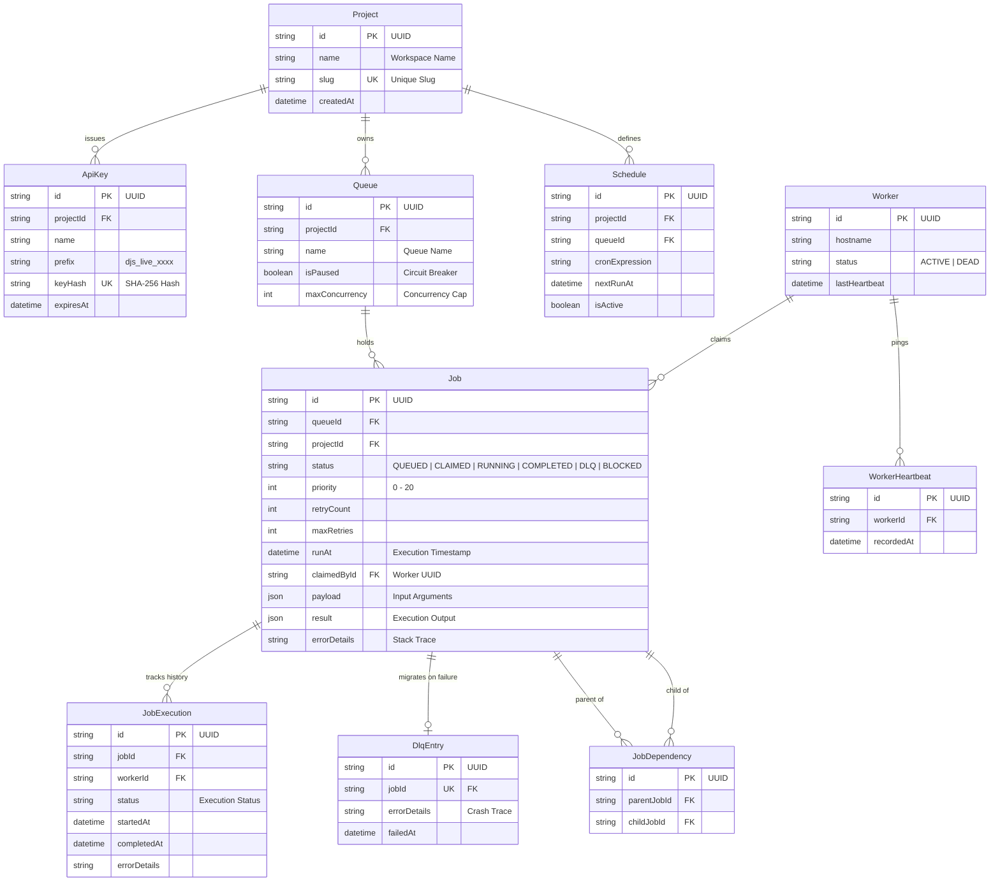

# Database Design & Entity-Relationship Model

Obsidian Distributed uses a **normalized PostgreSQL schema** designed around multi-tenancy, reliable job execution, workflow dependencies, and distributed worker coordination.

The database acts as the system of record for projects, queues, jobs, schedules, workers, execution history, and failed jobs.

The schema enforces **referential integrity through foreign keys**, while indexes and transactional operations support efficient job claiming and concurrent worker execution.

---

## Entity-Relationship Diagram



---

# Entity Overview

| Entity            | Purpose                                            |
| ----------------- | -------------------------------------------------- |
| `Project`         | Represents an isolated tenant/workspace            |
| `ApiKey`          | Authentication credential issued to a project      |
| `Queue`           | Logical job queue owned by a project               |
| `Job`             | Individual unit of background work                 |
| `JobExecution`    | Historical record of each execution attempt        |
| `JobDependency`   | Represents parent-child relationships between jobs |
| `Schedule`        | Defines recurring cron-based job creation          |
| `DlqEntry`        | Stores jobs that permanently failed                |
| `Worker`          | Represents a worker process/node                   |
| `WorkerHeartbeat` | Tracks worker liveness                             |

---

# 1. Project

A `Project` is the top-level tenant boundary.

All project-owned resources are associated with a project, providing logical isolation between different applications or customers.

```text
Project
   │
   ├── API Keys
   ├── Queues
   ├── Jobs
   └── Schedules
```

### Important Fields

| Field       | Description                    |
| ----------- | ------------------------------ |
| `id`        | Unique project UUID            |
| `name`      | Human-readable workspace name  |
| `slug`      | Unique URL/resource identifier |
| `createdAt` | Project creation timestamp     |

---

# 2. API Keys

`ApiKey` stores authentication credentials for accessing the API.

The actual secret key should **never be stored in plaintext**.

Instead, the system stores a cryptographic hash:

```text
Raw API Key
     │
     ▼
SHA-256
     │
     ▼
keyHash
```

The key prefix can be stored separately to make credentials identifiable without exposing the secret.

Example:

```text
djs_live_xxxx...
└─────┬─────┘
    Prefix
```

### Important Fields

| Field       | Description                     |
| ----------- | ------------------------------- |
| `projectId` | Project that owns the key       |
| `name`      | Human-readable key name         |
| `prefix`    | Safe identifier for the API key |
| `keyHash`   | SHA-256 hash of the secret      |
| `expiresAt` | Optional expiration timestamp   |

---

# 3. Queue

A queue groups related jobs and controls how they are processed.

Each queue belongs to exactly one project.

### Queue Controls

* Pause/resume processing
* Maximum concurrency
* Queue-level execution isolation

Example:

```text
Production Analytics
       │
       ├── default
       ├── emails
       └── data-sync
```

A paused queue prevents workers from claiming new jobs from that queue.

---

# 4. Job

The `Job` entity represents the core unit of work.

A job belongs to both a project and a queue.

### Job Lifecycle

```text
                    ┌───────────┐
                    │  BLOCKED  │
                    └─────┬─────┘
                          │
                     Dependencies
                      satisfied
                          │
                          ▼
┌────────┐          ┌─────────┐
│ QUEUED │ ────────►│ CLAIMED │
└────────┘          └────┬────┘
                         │
                         ▼
                    ┌─────────┐
                    │ RUNNING │
                    └────┬────┘
                         │
               ┌─────────┴─────────┐
               ▼                   ▼
          COMPLETED              FAILED
                                   │
                              Retry available?
                              /            \
                            YES             NO
                             │               │
                             ▼               ▼
                           QUEUED            DLQ
```

### Important Fields

| Field          | Description                              |
| -------------- | ---------------------------------------- |
| `queueId`      | Queue containing the job                 |
| `projectId`    | Owning project                           |
| `status`       | Current execution state                  |
| `priority`     | Determines execution ordering            |
| `retryCount`   | Number of attempts already made          |
| `maxRetries`   | Maximum allowed retry attempts           |
| `runAt`        | Earliest time the job can execute        |
| `claimedById`  | Worker currently responsible for the job |
| `payload`      | Input data required by the worker        |
| `result`       | Output produced by execution             |
| `errorDetails` | Error or stack trace from failure        |

---

# 5. Job Execution History

`JobExecution` records individual execution attempts for a job.

This separates the **current state of a job** from its historical execution data.

For example, a job that fails twice and succeeds on the third attempt can have:

```text
Job
 │
 ├── Execution #1 → FAILED
 ├── Execution #2 → FAILED
 └── Execution #3 → COMPLETED
```

This provides useful observability without overwriting historical information.

### Stored Information

* Worker that executed the job
* Execution status
* Start time
* Completion time
* Error information

---

# 6. Job Dependencies

`JobDependency` represents a directed relationship between two jobs.

```text
Parent Job
    │
    ▼
Child Job
```

For example:

```text
Fetch Data
    │
    ├──────► Transform Data
    │              │
    │              ▼
    │          Generate Report
    │
    └──────► Validate Data
```

The child remains `BLOCKED` until its required parent jobs have completed.

This enables DAG-style workflows while keeping dependencies stored explicitly in the database.

---

# 7. Schedules

A `Schedule` defines recurring execution using a cron expression.

Example:

```text
*/5 * * * *
```

This represents a schedule that runs every five minutes.

### Important Fields

| Field            | Description                    |
| ---------------- | ------------------------------ |
| `projectId`      | Owning project                 |
| `queueId`        | Queue receiving scheduled jobs |
| `cronExpression` | Recurrence definition          |
| `nextRunAt`      | Next scheduled execution       |
| `isActive`       | Enables/disables the schedule  |

Workers coordinate schedule execution using PostgreSQL advisory locks to prevent multiple workers from generating duplicate jobs.

---

# 8. Dead Letter Queue

`DlqEntry` stores permanently failed jobs.

A job enters the DLQ after exhausting its configured retry policy.

```text
Job
 │
 ▼
Failed
 │
 ▼
Retry
 │
 ▼
Retry Limit Reached
 │
 ▼
DlqEntry
```

The DLQ preserves the failure information needed for debugging, inspection, and potential manual recovery.

The `jobId` is unique to ensure that a job has at most one DLQ entry.

---

# 9. Worker

A `Worker` represents a running worker process in the distributed worker cluster.

Workers are intentionally represented in the database so the system can track their availability and ownership of jobs.

### Worker States

```text
ACTIVE
  │
  │ heartbeat stops
  ▼
DEAD
```

### Important Fields

| Field           | Description                     |
| --------------- | ------------------------------- |
| `id`            | Worker UUID                     |
| `hostname`      | Host running the worker         |
| `status`        | Current worker state            |
| `lastHeartbeat` | Most recent heartbeat timestamp |

---

# 10. Worker Heartbeats

`WorkerHeartbeat` provides a historical record of worker health signals.

Workers periodically record a heartbeat:

```text
Worker
   │
   ├── Heartbeat #1
   ├── Heartbeat #2
   ├── Heartbeat #3
   └── Heartbeat #4
```

The latest heartbeat can be used to determine whether a worker is still alive.

This is particularly useful for detecting workers that terminate unexpectedly while processing jobs.

---

# Referential Integrity

Foreign keys enforce relationships between entities.

For example:

```text
Project
   │
   ├── Queue.projectId
   ├── ApiKey.projectId
   └── Schedule.projectId
```

Similarly:

```text
Queue
   │
   └── Job.queueId

Job
   │
   ├── JobExecution.jobId
   ├── DlqEntry.jobId
   └── JobDependency.parentJobId / childJobId
```

This prevents orphaned records and keeps the data model consistent.

---

# Multi-Tenant Data Isolation

Every project acts as a logical tenant boundary.

A typical query is scoped by `projectId`:

```sql
SELECT *
FROM jobs
WHERE project_id = $1;
```

API authentication resolves the API key to its associated project before accessing project-owned resources.

This prevents one project from accessing another project's jobs, queues, or schedules.

---

# Indexing Strategy

The database should prioritize indexes around the system's most frequent access patterns.

### Job Claiming

Workers frequently search for executable jobs:

```sql
WHERE status = 'QUEUED'
  AND run_at <= NOW()
```

An index on fields such as:

```text
(status, runAt, priority)
```

helps workers efficiently locate eligible jobs.

### Project Scoping

Frequently queried project-owned resources should be indexed by:

```text
projectId
```

Examples:

```text
Queue.projectId
Job.projectId
Schedule.projectId
ApiKey.projectId
```

### Job History

Execution history is commonly accessed by job:

```text
JobExecution.jobId
```

Therefore this relationship should be indexed.

---

# Data Consistency & Transactions

Critical state transitions should occur inside PostgreSQL transactions.

For example, claiming a job should atomically:

1. Select an eligible job.
2. Lock the row.
3. Mark the job as claimed/running.
4. Associate the worker.
5. Commit the transaction.

Conceptually:

```text
BEGIN
  │
  ├── Find eligible job
  │
  ├── FOR UPDATE SKIP LOCKED
  │
  ├── Assign worker
  │
  ├── Update job status
  │
  └── COMMIT
```

If the transaction fails, PostgreSQL rolls back the changes, preventing partially applied job claims.

---

# Storage Design Goals

The database design prioritizes:

* **Strong tenant isolation**
* **Referential integrity**
* **Atomic job state transitions**
* **Concurrent worker execution**
* **Reliable retry tracking**
* **DAG workflow representation**
* **Execution history**
* **Dead-letter handling**
* **Worker health tracking**
* **Efficient queue polling**

The database is therefore more than persistent storage — it is a core part of the distributed coordination model.

> **PostgreSQL stores the state of the system and provides the synchronization primitives that allow independent API and worker processes to operate safely at scale.**
